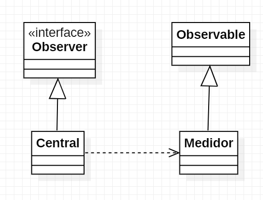

# Padrão de Projeto - Observer

Útil quando um objeto precisa ser atualizado quando outro muda.  
Exemplo principal - notificações!

**Caso de uso**: Medidor de usina hidroeletrica alerta central quando pressao em uma seção da usina está muito acima do esperado;

Central = conecta ao medidor
Medidor = emite alerta para a central

